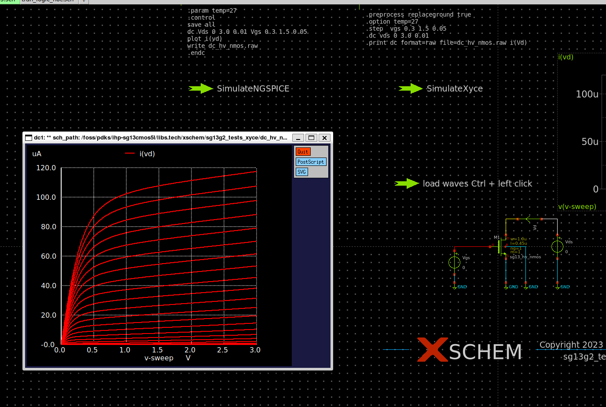
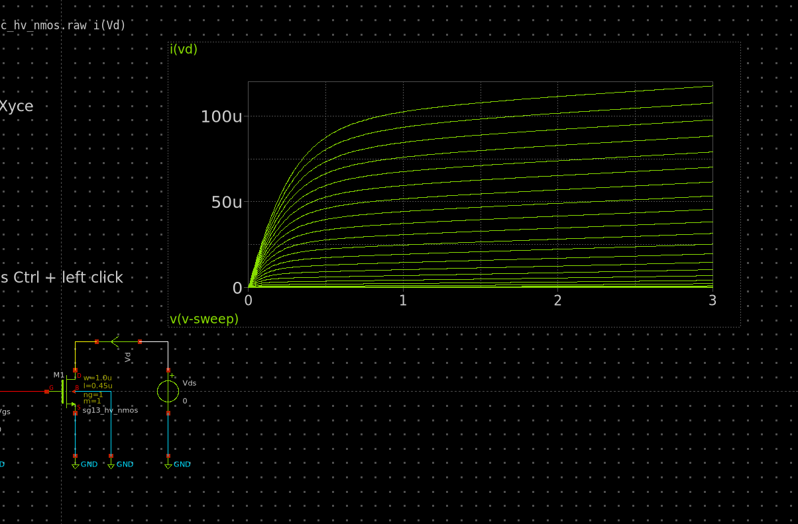
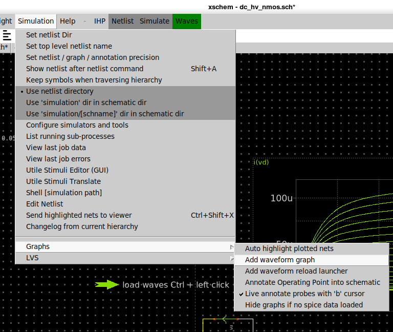
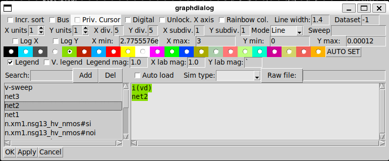
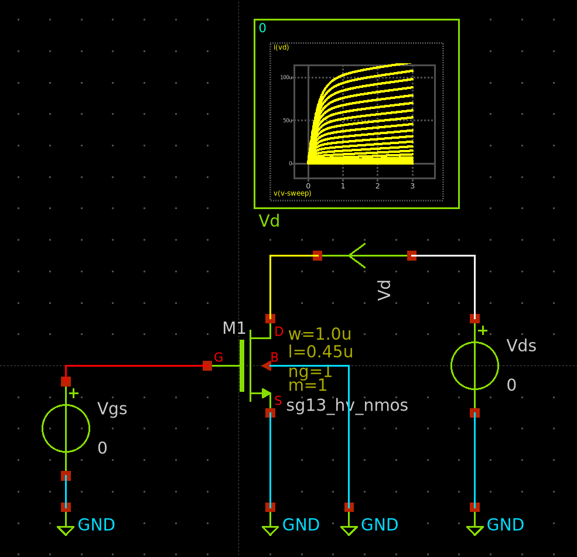
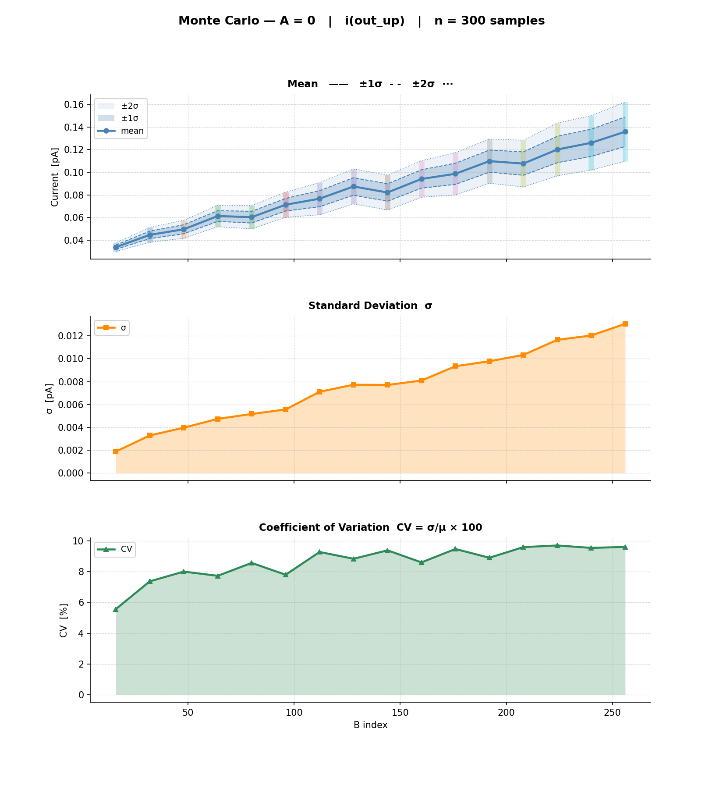
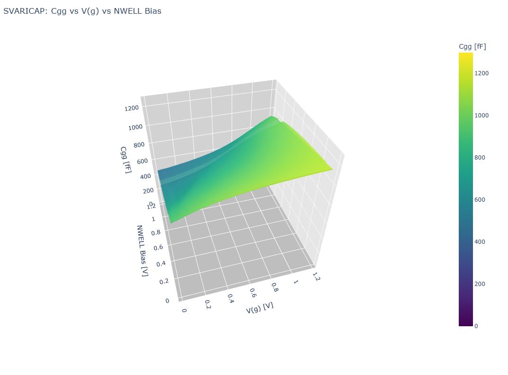
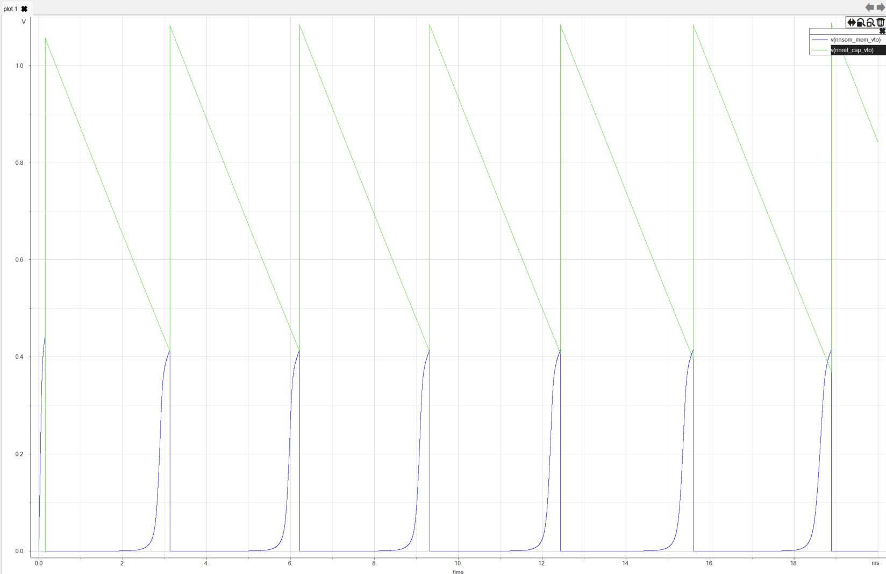
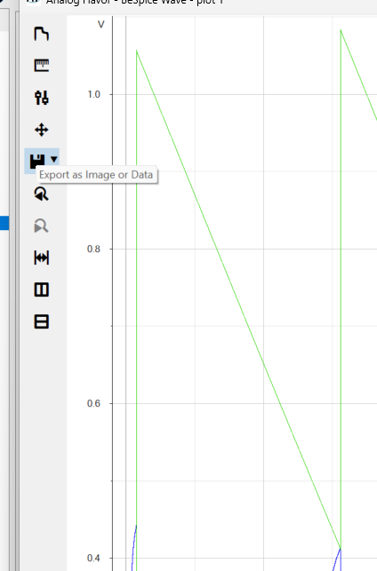

# Output Analysis

Here I propose 3 very useful ways for analyzing the results of your simulations. Each has its own strengths and weaknesses, so the best things is to use them in combination depending on your needs.

---

## Tool Comparison


| Tool / Method | Best For | Pros | Cons |
| :--- | :--- | :--- | :--- |
| **In-Schematic: `plot V(net)`** *(Option A)* | Instant, zero-setup sanity checks | Pop-up window triggers automatically with zero configuration. | Uses raw, retro X11 system graphics. Hard to customize. |
| **In-Schematic: Graphs** *(Option B)* | Embedded visual feedback | Plotted directly on the canvas; fast axis panning/zooming; highly configurable. | Lines can look jagged; background is black; not suited for formal papers. |
| **In-Schematic: Scope Symbol** *(Option C)* | Educational & clean schematics | Wire-level debugging; shows waveforms directly over the physical circuit node. | Tiny visual area; easily clutters the schematic layout if overused. |
| **Python Plot Script** | Publication-grade plots & complex analysis | Infinite flexibility; perfect for 3D plots, Monte Carlo, and AI script-generation. | Requires basic coding; slower workflow for quick iterative debugging. |
| **BeSpice Wave (Free)** | High-performance, clean interactive debugging | Extremely fast file loading; unmatched precision cursor system; clean UI. | Restricted features (no Y-axis log scale, no curve renaming without license). |

---

---

## Xschem In-Schematic Visualization

Xschem offers unique features to display waveforms directly on your canvas. While incredibly fast and great for teaching, they come with layout trade-offs.

### Quick Command-Line Plots (`plot V(net2)`)
Instead of opening an external tool, you can instruct Ngspice to pop up a quick visualizer window immediately after simulating by using a simple command block in your schematic.



#### How to instantiate it:
 You place a text symbol (like `code_shown.sym` ) on your canvas and write a standard SPICE control block containing:
  ```spice
  .control
    tran 1n 10u
    plot v(net2) v(net3)
  .endc
  ```

#### How to use it:
 To zoom on the curves, you can draw a rectangle + <kbd>right button</kbd>.

### On-Schematic Waveform Graphs (`devices/launcher.sym` & `ngspice_plot`)
You can embed full, multi-signal waveform plotting windows directly inside your schematic canvas. 



#### How to instantiate it:
Add a scope and a wave loader to your schematic. 


#### How to use it:
 To zoom use <kbd>shift</kbd> + <kbd>mouse wheel</kbd> on one of the axes, to pan use the mouse wheel.

 The plot is highly settable double click on the plot to open the settings window :


---

### The "Scope" Symbol (`devices/probes/scope.sym`)
Xschem includes a small "scope" symbol that you can wire directly to any node in your schematic.



#### How to instantiate it:
Add it as a symbol in `devices/probes/scope.sym`

#### How to use it:
<kbd>Alt+G</kbd> on the net that you want to plot.
<kbd>Ctrl</kbd> + <kbd>Shift</kbd> + <kbd>Mouse wheel</kbd> to zoom in/out, <kbd>Ctrl</kbd> + <kbd>Mouse wheel</kbd> to pan. 

---


## Python Plot Script

For complex data analysis, optimization, or generating publication-quality figures, parsing the SPICE `.raw` or `.csv` files with Python is the gold standard.


### How to instantiate it:
It's especially convinient because of AI generated scripts*
The `spicelib.raw.raw_read` lib is usefull to read the raw files from Ngspice.

### Example :

Monte Carlo Analysis


3D plotting of MosCap value vs. (gate voltage, bulk voltage)


## Bespice Waveform Viewer

### Free version 
User friendly UI.
Very fast, and clean visualization of waveforms, with a very good cursor system.

### free version limitations :

-curves renaming
-logarithmic scale on y axis

to export an image directly from the viewer, you need to detach the plot window from the main application window :



 then use export BMP image : 
 