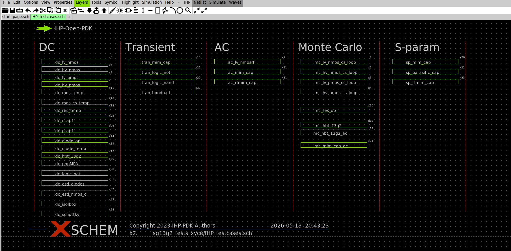
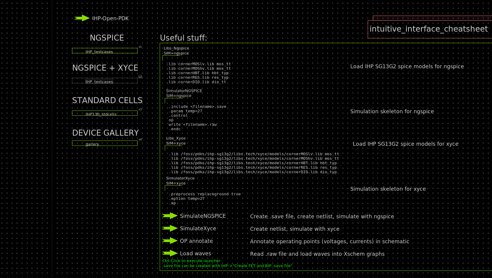
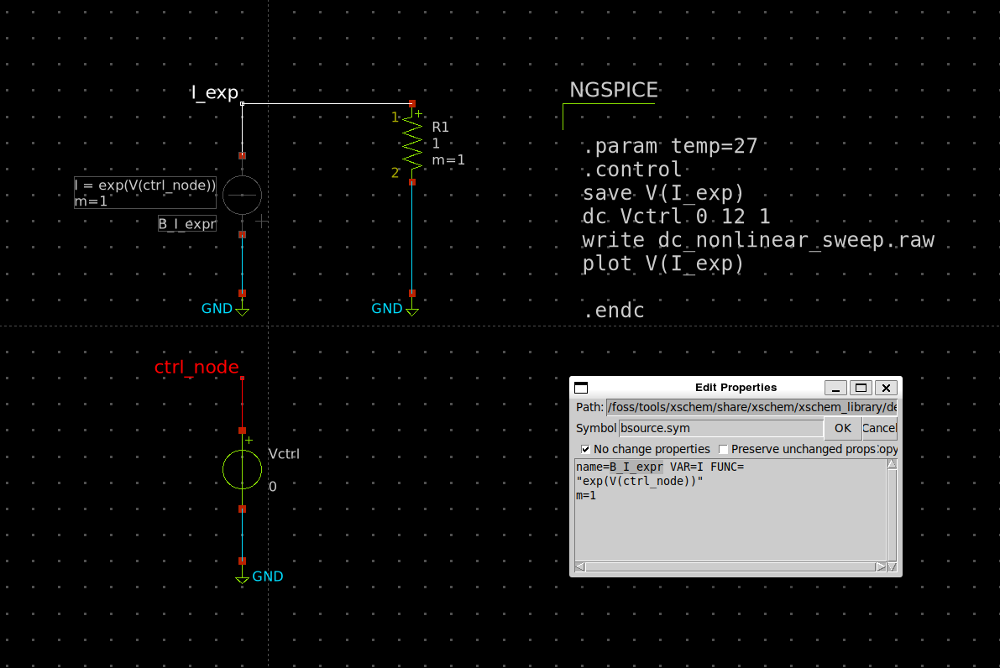

# Output Analysis

When you are use to classic simulation mode of Ngspice such as (dc, tran, ac, op ...), you will see that there is some limitations in terms of convergence/speed, or possibilities of simulation

---

## Essential resources + bonus resources

### Built-In test benches of the PDK

The first thing to do when you want to create a new test bench is to check if this test bench already exists in the `libs.tech/xschem/{pdk_name}_test` folder.

You can acces it from the `start_page.sch` by clicking on testcase symbol then <kbd>alt+e</kbd>(that make open the schematic of any symbol and <kbd>alt+i</kbd> to open the symbol file).

---

### Ngspice pdf documentation

Currently Claude is one of the only reliable AI on spice simulation script but still struggle on a lot of syntax, so right now the only fully reliable source of information is the official Ngspice documentation. Don't hesite to feed your LLM with it.
You can find it here : [Ngspice Manual](https://share.google/s9O5CPyZSPrrWq2hZ)

---

### Analog (Integrated) Circuit Design courses using the the IIC-OSIC-TOOLS docker 

A very clean way of using he docker and sizing your transistors using the pygmid for the gm/Id methodology.
[Analog (Integrated) Circuit Design](https://iic-jku.github.io/analog-circuit-design/aicd.pdf?utm_source=chatgpt.com)

--- 

## OP/DC simulation

DC is an optimise version of running several op in a simulation script for speed optimisation and it output directly all the result in one file, but it come with some limitations. 

### convergence optimisation

### test bench setup technics (with templates)

#### DC non-linear sweep
To make a non-linear sweep you can use a bsource as V or I source with any [math function (go page 106)](https://share.google/s9O5CPyZSPrrWq2hZ) in the FUNC parameter and a node voltage as sweep variable.

Download test bench here : 
<a href="./../..test_bench/nonlinear_sweep_dc_tb.sch" download>nonlinear_sweep_dc_tb.sch </a>
---

